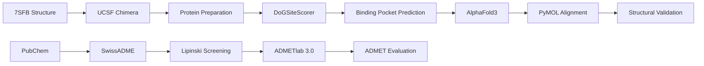

<div align="center">

# 🧬 7SFB-CADD-Pipeline

### AI-Assisted Structure-Based Drug Discovery of SARS-CoV-2 Main Protease (7SFB)


<br>


<br>

### Computational Biology × Structural Bioinformatics × AI

</div>

---

## 🌍 Overview

This repository presents a complete **Computer-Aided Drug Design (CADD)** workflow targeting the **SARS-CoV-2 Main Protease (Mpro)** using the experimentally resolved protein structure **7SFB**.

The project integrates:

- 🧪 Drug-Likeness Screening
- 🧬 Protein Preparation
- 🎯 Binding Site Prediction
- 📊 ADMET Profiling
- 🤖 AI-Based Structure Validation
- 🔬 Structural Bioinformatics

to evaluate ligand suitability, protein druggability, pharmacokinetic properties, and AI-predicted structural reliability.

---

# 🦠 Target Protein

<div align="center">


<br>

*Experimental crystal structure of SARS-CoV-2 Main Protease (7SFB)*

</div>

| Parameter | Value |
|------------|------------|
| Protein | SARS-CoV-2 Main Protease (Mpro / 3CLpro) |
| PDB ID | 7SFB |
| Resolution | 1.90 Å |
| Method | X-Ray Diffraction |
| Function | Viral Replication Enzyme |
| Target Class | Antiviral Drug Target |

---

# 🎯 Research Objective

To computationally evaluate selected ligands against SARS-CoV-2 Main Protease through:

✅ Drug-likeness screening

✅ Protein preparation

✅ Binding pocket characterization

✅ ADMET profiling

✅ AI-assisted structure validation

---

# ⚙️ Computational Workflow



---

# 💊 Ligands Evaluated

| Compound | PubChem CID |
|-----------|-----------|
| Aspirin | 2244 |
| Ibuprofen | 3672 |
| Acetaminophen | 1983 |
| Naproxen | 156391 |
| Diclofenac | 3033 |

---

# 🧪 Drug-Likeness Screening

All compounds were evaluated using **SwissADME** and **Lipinski's Rule of Five**.

---

## Molecular Structures

<table>
<tr>

<td align="center">

<b>Aspirin</b>

<br>


</td>

<td align="center">

<b>Ibuprofen</b>

<br>


</td>

</tr>

<tr>

<td align="center">

<b>Acetaminophen</b>

<br>


</td>

<td align="center">

<b>Naproxen</b>

<br>


</td>

</tr>

</table>

<div align="center">

<b>Diclofenac</b>

<br><br>


</div>

---

## Lipinski Rule of Five Results

| Compound | MW | HBD | HBA | LogP | Status |
|-----------|-----------|-----------|-----------|-----------|-----------|
| Aspirin | 180.16 | 1 | 4 | 1.28 | ✅ Pass |
| Ibuprofen | 206.28 | 1 | 2 | 3.21 | ✅ Pass |
| Acetaminophen | 151.16 | 2 | 2 | 0.86 | ✅ Pass |
| Naproxen | 230.26 | 1 | 3 | 2.96 | ✅ Pass |
| Diclofenac | 296.15 | 2 | 2 | 4.09 | ✅ Pass |

> **All five compounds satisfied Lipinski's Rule of Five, indicating favorable physicochemical properties and potential oral bioavailability.**

---

# 🧬 Protein Preparation

Protein preparation was performed using **UCSF Chimera** to generate a docking-ready structure.

---

## Before Preparation

<div align="center">


</div>

### Raw Experimental Structure

Contains:

- Water molecules
- Heteroatoms
- Crystallographic artifacts

---

## After Preparation

<div align="center">


</div>

### Docking-Ready Structure

Performed:

- Chain A selection
- Water removal
- Heteroatom removal
- Hydrogen addition
- Gasteiger charge assignment

---

# 🎯 Binding Site Prediction

Binding pocket analysis was performed using **DoGSiteScorer**.

---

<div align="center">


</div>

---

## Primary Binding Pocket

| Parameter | Value |
|------------|------------|
| Pocket ID | P_0 |
| Volume | 642.94 ų |
| Surface Area | 776.96 Ų |
| Druggability Score | 0.75 |

---

## Key Binding Residues

```text
THR25
THR26
LEU27
HIS41
VAL42
```

---

## DoGSiteScorer Results

<div align="center">


</div>

---

### Interpretation

The identified binding cavity demonstrated:

- High druggability
- Large accessible volume
- Favorable surface area
- Catalytically relevant residues

These characteristics make the pocket suitable for ligand accommodation and molecular docking studies.

---

# 📊 ADMET Profiling

ADMET properties were predicted using **ADMETlab 3.0**.

---

<div align="center">


</div>

---

## Comparative Analysis

| Compound | Assessment |
|-----------|-----------|
| Aspirin | ⭐ Balanced Profile |
| Ibuprofen | ⭐ Balanced Profile |
| Acetaminophen | ⚠ Hepatotoxicity Considerations |
| Naproxen | ⚠ Longer Half-Life |
| Diclofenac | ⚠ Elevated Toxicity Risk |

---

### Key Observations

- Aspirin and Ibuprofen demonstrated favorable ADMET profiles.
- Acetaminophen exhibited efficient clearance but hepatotoxicity concerns.
- Naproxen displayed prolonged biological persistence.
- Diclofenac showed strong plasma protein binding with elevated toxicity indicators.

---

# 🤖 AlphaFold3 Structure Validation

To evaluate AI-based structure prediction reliability, the sequence of 7SFB Chain A was submitted to AlphaFold3.

---

## AlphaFold3 Predicted Structure

<div align="center">


</div>

---

## Experimental vs Predicted Overlay

<div align="center">


</div>

---

## Structural Comparison

| Metric | Result |
|-----------|-----------|
| RMSD | 0.616 Å |
| Atoms Aligned | 1997 |
| Structural Agreement | Excellent |
| Confidence | High |

---

### Structural Interpretation

The AlphaFold3-predicted model demonstrated excellent agreement with the experimentally resolved crystal structure.

#### Highlights

✅ RMSD below 1 Å

✅ Strong structural overlap

✅ High-confidence pLDDT regions

✅ Minor deviations restricted to flexible loops

---

# 🏆 Major Findings

```diff
+ All ligands passed Lipinski screening
+ Binding pocket exhibited strong druggability
+ ADMET profiling identified candidate-specific trade-offs
+ AlphaFold3 achieved excellent structural agreement
+ RMSD = 0.616 Å
+ AI-based structure prediction successfully reproduced experimental architecture
```

---

# 📂 Repository Structure

```text
7sfb-cadd-pipeline/

├── README.md
├── LICENSE
├── .gitignore
│
├── data/
│   ├── raw/
│   └── processed/
│
├── structures/
│   ├── experimental/
│   ├── alphafold/
│   └── aligned/
│
├── figures/
│   ├── hero-banner.png
│   ├── aspirin.png
│   ├── ibuprofen.png
│   ├── acetaminophen.png
│   ├── naproxen.png
│   ├── diclofenac.png
│   ├── raw-7sfb.png
│   ├── prepared-7sfb.png
│   ├── binding-pocket.png
│   ├── dogsite-results.png
│   ├── admet-results.png
│   ├── alphafold3-model.png
│   └── structure-overlay.png
│
├── results/
└── docs/
```

---

# 🛠 Tools & Technologies

| Category | Tool |
|-----------|-----------|
| Protein Visualization | PyMOL |
| Protein Preparation | UCSF Chimera |
| Drug-Likeness Screening | SwissADME |
| Binding Site Prediction | DoGSiteScorer |
| ADMET Prediction | ADMETlab 3.0 |
| AI Structure Prediction | AlphaFold3 |

---

# 🌟 Scientific Significance

The SARS-CoV-2 Main Protease remains one of the most important antiviral drug targets due to its essential role in viral replication.

This project demonstrates the integration of:

- Computational Biology
- Structural Bioinformatics
- Drug Discovery Informatics
- Artificial Intelligence

within a unified early-stage drug discovery workflow.

---

# 👩‍🔬 Author

## Ayushi

**Final Year B.Sc. Chemistry**

Computational Biology • Bioinformatics • Structural Bioinformatics • CADD

### Research Interests

🧬 Computational Biology

💊 Drug Discovery

🤖 AI in Life Sciences

🔬 Structural Bioinformatics

---

<div align="center">

### ⭐ Star this repository if you found it useful

### Computational Biology × Structural Bioinformatics × AI

</div>
