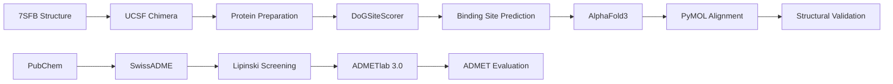
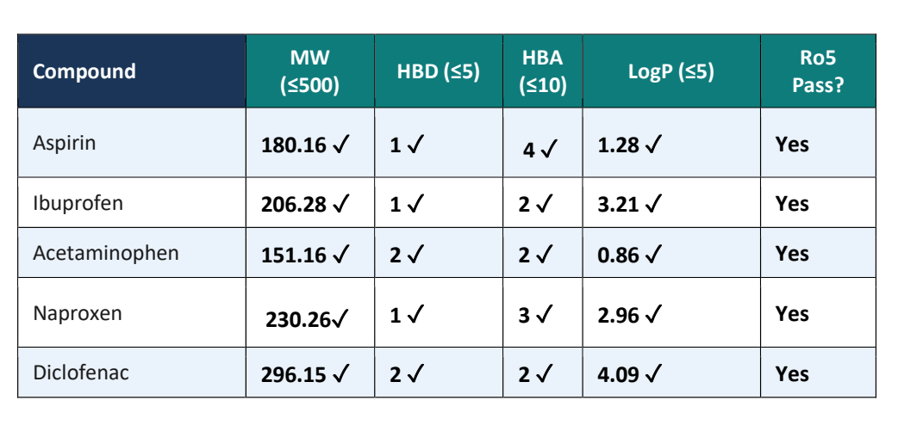
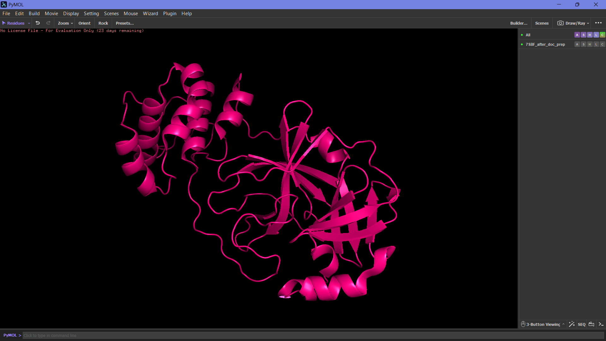
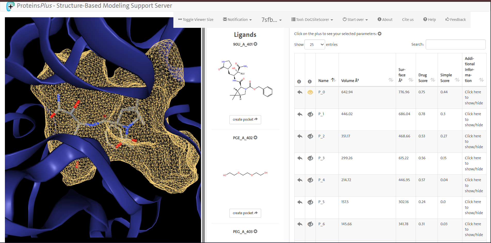
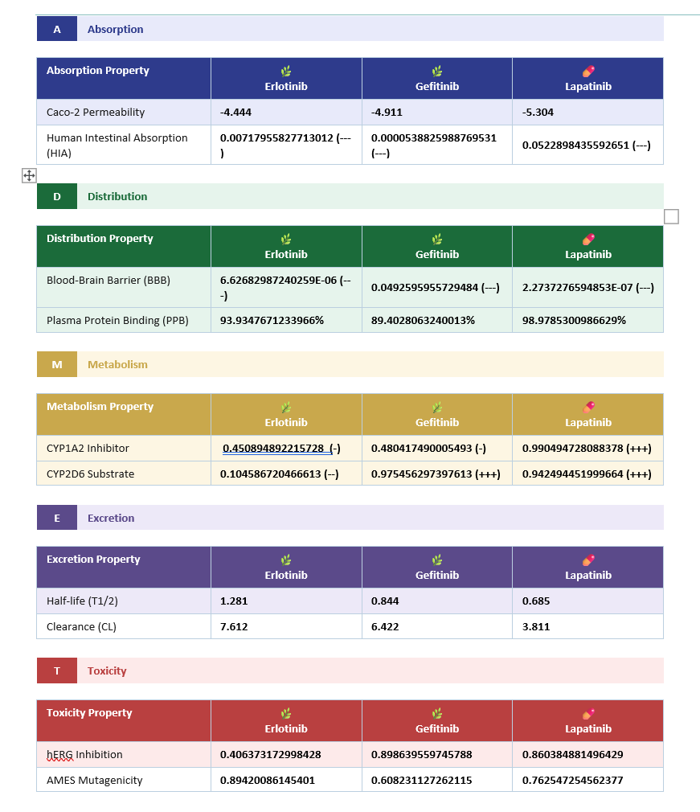
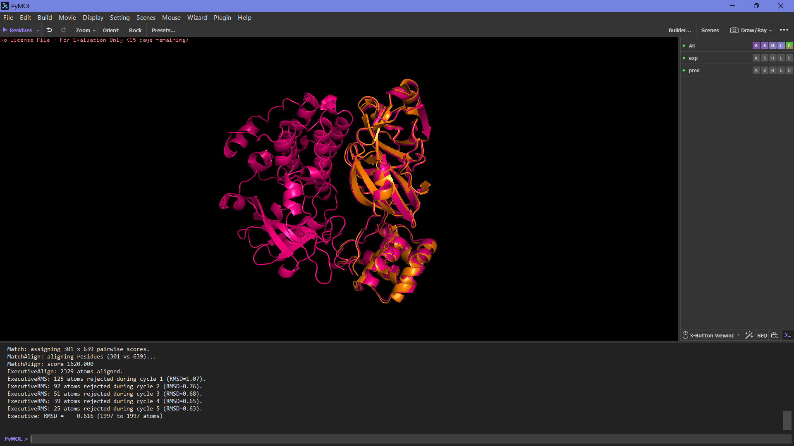

<div align="center">

# 🧬 7SFB-CADD-Pipeline

### AI-Assisted Structure-Based Drug Discovery of SARS-CoV-2 Main Protease (7SFB)


### Computational Biology × Structural Bioinformatics × AI

</div>

---

## 🌍 Overview

This repository presents a complete Computer-Aided Drug Design (CADD) workflow targeting the SARS-CoV-2 Main Protease (Mpro) using the experimentally resolved protein structure **7SFB**.

The workflow integrates:

- Drug-Likeness Screening
- Protein Preparation
- Binding Site Prediction
- ADMET Profiling
- AI-Based Structure Validation
- Structural Bioinformatics Analysis

to evaluate ligand suitability, protein druggability, pharmacokinetic properties, and AI-predicted structural reliability.

---

# 🎯 Research Objective

To computationally evaluate selected ligands against SARS-CoV-2 Main Protease through:

✅ Drug-likeness screening

✅ Protein preparation

✅ Binding pocket characterization

✅ ADMET profiling

✅ AI-assisted structure validation

---

# 🦠 Target Protein

| Parameter | Value |
|------------|------------|
| Protein | SARS-CoV-2 Main Protease (Mpro / 3CLpro) |
| PDB ID | 7SFB |
| Experimental Method | X-Ray Diffraction |
| Resolution | 1.90 Å |
| Function | Viral Replication Enzyme |
| Drug Target Class | Antiviral Target |

---

# ⚙️ Computational Workflow



---

# 💊 Ligands Evaluated

| Compound | PubChem CID |
|-----------|-----------|
| Aspirin | 2244 |
| Ibuprofen | 3672 |
| Acetaminophen | 1983 |
| Naproxen | 156391 |
| Diclofenac | 3033 |

---

# 🧪 Drug-Likeness Screening

All compounds were evaluated using SwissADME and Lipinski's Rule of Five.

<div align="center">



</div>

### Key Finding

All five ligands satisfied Lipinski's Rule of Five, indicating favorable physicochemical properties and potential oral bioavailability.

---

# 🧬 Protein Preparation

Protein preparation was performed using UCSF Chimera to generate a docking-ready structure.

<div align="center">



</div>

### Preparation Steps

- Chain A selection
- Water molecule removal
- Heteroatom removal
- Hydrogen addition
- Gasteiger charge assignment

Output:

```text
7SFB_prepared.pdb
```

---

# 🎯 Binding Site Prediction

Binding pocket analysis was performed using DoGSiteScorer.

<div align="center">



</div>

### Primary Binding Pocket

| Parameter | Value |
|------------|------------|
| Pocket ID | P_0 |
| Volume | 642.94 ų |
| Surface Area | 776.96 Ų |
| Druggability Score | 0.75 |

### Key Residues

```text
THR25
THR26
LEU27
HIS41
VAL42
```

---

# 📊 ADMET Profiling

ADMET properties were predicted using ADMETlab 3.0.

<div align="center">



</div>

### Comparative Findings

| Compound | Assessment |
|-----------|-----------|
| Aspirin | ⭐ Balanced Profile |
| Ibuprofen | ⭐ Balanced Profile |
| Acetaminophen | ⚠ Hepatotoxicity Concern |
| Naproxen | ⚠ Longer Half-Life |
| Diclofenac | ⚠ Elevated Toxicity Risk |

---

# 🤖 AlphaFold3 Structure Validation

The sequence of 7SFB Chain A was submitted to AlphaFold3 for AI-based protein structure prediction.

<div align="center">



</div>

### Structural Comparison

| Metric | Result |
|-----------|-----------|
| RMSD | 0.616 Å |
| Atoms Aligned | 1997 |
| Structural Agreement | Excellent |
| Confidence | High |

### Interpretation

The AlphaFold3-predicted model demonstrated excellent agreement with the experimentally resolved crystal structure, validating the reliability of AI-assisted protein structure prediction.

---

# 🏆 Major Findings

```diff
+ All ligands passed Lipinski screening
+ High-druggability binding pocket identified
+ ADMET profiling highlighted candidate-specific trade-offs
+ AlphaFold3 achieved excellent structural agreement
+ RMSD = 0.616 Å
+ Strong support for AI-assisted structural biology workflows
```

---

# 📂 Repository Structure

```text
7sfb-cadd-pipeline/

├── README.md
├── LICENSE
├── .gitignore
│
├── data/
│   ├── raw/
│   └── processed/
│
├── structures/
│   ├── experimental/
│   ├── alphafold/
│   └── aligned/
│
├── figures/
│   ├── lipinski_analysis.png
│   ├── protein_preparation.png
│   ├── binding_site.png
│   ├── admet_results.png
│   └── alphafold_alignment.png
│
├── results/
└── docs/
```

---

# 🛠 Tools & Technologies

| Category | Tool |
|-----------|-----------|
| Drug-Likeness Screening | SwissADME |
| Protein Preparation | UCSF Chimera |
| Binding Site Prediction | DoGSiteScorer |
| ADMET Prediction | ADMETlab 3.0 |
| Protein Visualization | PyMOL |
| AI Structure Prediction | AlphaFold3 |

---

# 🌟 Scientific Relevance

The SARS-CoV-2 Main Protease remains one of the most extensively studied antiviral drug targets due to its essential role in viral replication.

This repository demonstrates the integration of Computational Biology, Structural Bioinformatics, Drug Discovery Informatics, and Artificial Intelligence within a unified early-stage drug discovery workflow.

---

# 👩‍🔬 Author

## Ayushi

Final Year B.Sc. Chemistry

Computational Biology • Bioinformatics • CADD

### Research Interests

🧬 Computational Biology

💊 Drug Discovery

🤖 Artificial Intelligence in Life Sciences

🔬 Structural Bioinformatics

---

<div align="center">

### ⭐ Star this repository if you found it useful.

### Computational Biology × Structural Bioinformatics × AI

</div>
